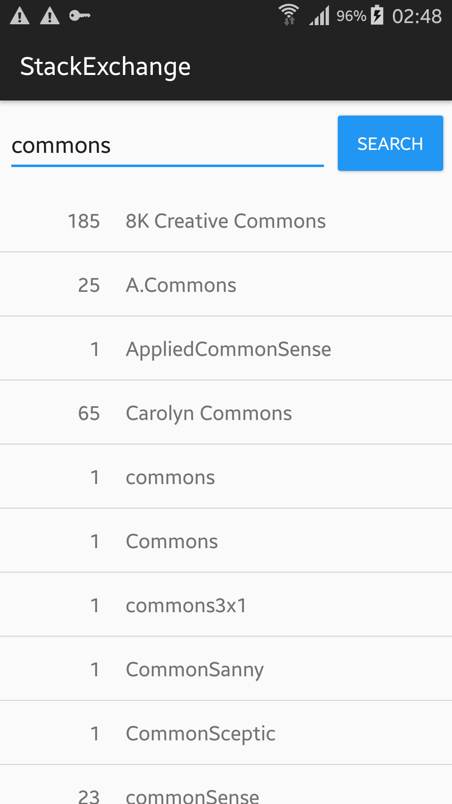
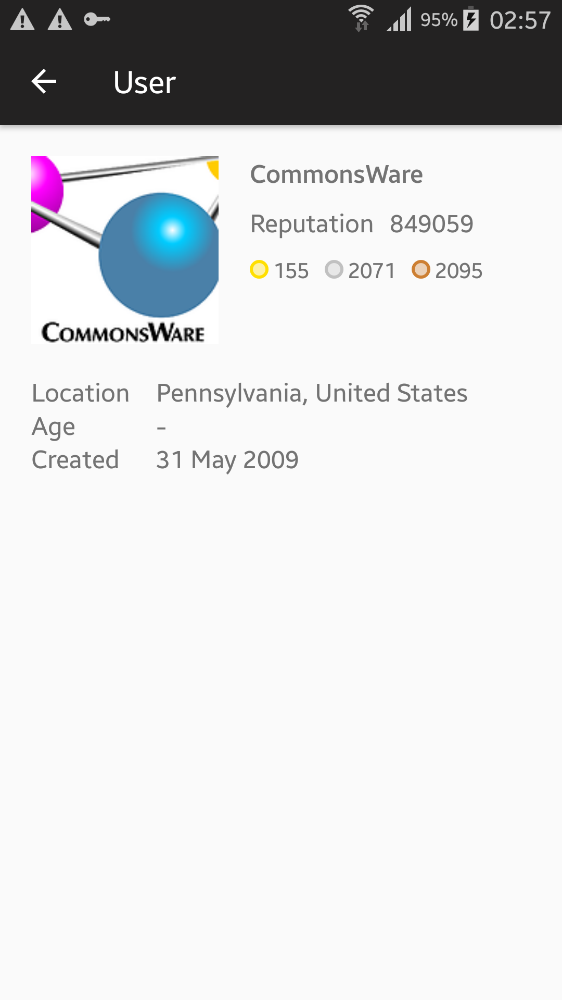

# Stack Exchange User Search

 

    
    &nbsp;&nbsp;&nbsp;&nbsp;&nbsp;&nbsp;&nbsp;&nbsp;&nbsp;&nbsp;&nbsp;&nbsp;
    

 

# Behaviour

- When the app is launched, a search box will be shown for searching users on StackOverflow by username
- When search text is entered and search button clicked, api call will be made to endpoint https://api.stackexchange.com/2.2/users
and the list of first 20 matching users will be shown
- If text is not entered in the search field, the api call won't be made
- If the api call fails, a toast error message will be shown
- If one search has been already made and a list of users is displayed, the list won't be cleared until the search button is clicked with
non empty search query
- When it's clicked on a user from the list, a new screen will be open with more information about that user

